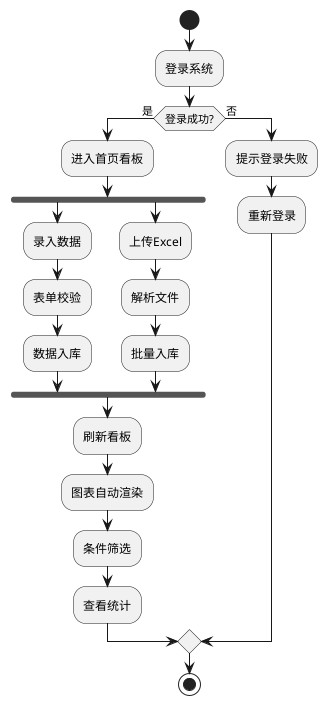
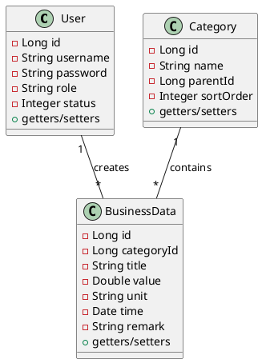

# 智慧数据可视化管理平台 - 课程项目文档

---

## 1 项目计划

### 1.1 项目简介

**项目名称**：智慧数据可视化管理平台

**所属行业**：企业数字化转型/数据中台

**核心功能**：
- 用户权限管理：登录认证、角色权限控制
- 基础分类管理：数据分类维护、层级管理
- 业务数据录入：表单录入、数据校验
- 批量数据导入：Excel文件解析、批量入库
- 可视化看板管理：多维度图表展示、条件筛选联动

**项目目标**：解决企业Excel数据零散、统计低效、无法直观数据分析的痛点，构建统一的数据管理与可视化平台。

---

### 1.2 项目背景

#### 1.2.1 政策支持
- 工信部《"十四五"信息化和工业化深度融合发展规划》强调推进企业数字化转型
- 国务院《"十四五"数字经济发展规划》明确提出加快数据要素市场化配置

#### 1.2.2 行业现状
- 传统企业数据管理依赖Excel表格，数据分散在各部门
- 缺乏统一的数据标准和管理规范
- 数据统计分析依赖人工，效率低下

#### 1.2.3 业务痛点
- 数据孤岛：各部门数据独立存储，无法共享
- 统计低效：人工汇总数据耗时且易出错
- 缺乏可视化：数据以表格形式呈现，难以发现业务趋势
- 权限混乱：数据访问权限缺乏统一管理

**参考来源**：
- [工信部官网](http://www.miit.gov.cn/)
- [数字中国建设峰会](https://www.dcits.com/)

---

### 1.3 功能需求分析

#### 1.3.1 痛点问题/核心业务

| 痛点问题 | 平台核心业务逻辑 |
|---------|-----------------|
| Excel数据零散 | 统一数据录入与存储 |
| 统计分析低效 | 自动化数据统计与图表生成 |
| 数据无法共享 | 权限管控下的数据共享 |
| 缺乏可视化 | 多维度图表看板展示 |
| 批量导入困难 | 支持Excel批量导入解析 |

#### 1.3.2 产品结构图

```
智慧数据可视化管理平台
├── 用户权限管理
│   ├── 用户登录
│   ├── 用户列表
│   └── 角色权限配置
├── 基础分类管理
│   ├── 分类列表
│   ├── 添加分类
│   └── 分类层级
├── 业务数据录入
│   ├── 表单录入
│   ├── 数据校验
│   └── 数据列表
├── 批量数据导入
│   ├── 文件上传
│   ├── 数据预览
│   └── 批量入库
└── 可视化看板管理
    ├── 数据筛选
    ├── 图表展示
    └── 统计分析
```

#### 1.3.3 主要业务流程描述



#### 1.3.4 信息结构图

```
系统实体数据
├── 用户实体
│   ├── 用户ID
│   ├── 用户名
│   ├── 密码（加密）
│   ├── 角色
│   └── 状态
├── 分类实体
│   ├── 分类ID
│   ├── 分类名称
│   ├── 父级分类ID
│   └── 排序号
└── 业务数据实体
    ├── 数据ID
    ├── 分类ID
    ├── 数据标题
    ├── 数据值
    ├── 单位
    ├── 时间
    └── 备注
```

---

## 2 前端设计与开发（Angular）

### 2.1 模块架构设计

#### 2.1.1 模块命名与结构

```
src/
├── app/
│   ├── login/              # 登录模块
│   ├── dashboard/          # 看板模块
│   ├── data-entry/         # 数据录入模块
│   ├── system-config/      # 系统配置模块
│   ├── components/         # 公共组件
│   ├── services/           # 服务层
│   ├── pipes/              # 管道
│   ├── models/             # 数据模型
│   └── app.module.ts
└── assets/
```

#### 2.1.2 页面命名与结构

| 页面名称 | 路由路径 | 组件文件 |
|---------|---------|---------|
| 登录页 | /login | login.component |
| 首页看板 | /dashboard | dashboard.component |
| 数据录入页 | /data-entry | data-entry.component |
| 系统配置页 | /system-config | system-config.component |

---

### 2.2 核心构造块设计

#### 2.2.1 页面

**登录页**

1. **DOM结构**：
   - 登录表单容器
   - 用户名输入框
   - 密码输入框
   - 登录按钮
   - 错误提示区域

2. **SCSS样式**：
   - 居中布局，渐变背景
   - 表单卡片阴影效果
   - 输入框聚焦状态动画

3. **TS核心逻辑**：
   - login()：登录请求方法
   - validateForm()：表单校验
   - handleError()：错误处理

**首页可视化看板页**

1. **DOM结构**：
   - 顶部筛选栏
   - 图表网格布局
   - 统计卡片区域
   - 分页控件

2. **SCSS样式**：
   - 响应式网格布局
   - 卡片悬停动画
   - 图表容器自适应

3. **TS核心逻辑**：
   - loadCharts()：加载图表数据
   - onFilterChange()：筛选条件变更
   - refreshCharts()：刷新图表

**业务数据录入页**

1. **DOM结构**：
   - 数据录入表单
   - 分类选择器
   - 数据预览区域
   - 提交/重置按钮

2. **SCSS样式**：
   - 表单两列布局
   - 必填字段标识
   - 表单校验状态样式

3. **TS核心逻辑**：
   - submitForm()：提交表单
   - resetForm()：重置表单
   - validateData()：数据校验

**系统配置页**

1. **DOM结构**：
   - 配置选项卡（用户/分类）
   - 用户列表表格
   - 分类树结构
   - 操作按钮组

2. **SCSS样式**：
   - 选项卡切换效果
   - 表格斑马纹
   - 树节点缩进样式

3. **TS核心逻辑**：
   - switchTab()：切换选项卡
   - loadUsers()：加载用户列表
   - loadCategories()：加载分类树

#### 2.2.2 组件

**通用搜索组件 (app-search)**

1. **DOM结构**：
   - 搜索输入框
   - 搜索按钮
   - 筛选下拉框

2. **SCSS样式**：
   - 搜索框圆角设计
   - 按钮悬浮效果

3. **TS逻辑**：
   - search()：触发搜索事件
   - onInputChange()：输入监听

**表格分页组件 (app-table-pagination)**

1. **DOM结构**：
   - 表格主体
   - 分页导航
   - 每页条数选择

2. **SCSS样式**：
   - 表格边框合并
   - 分页按钮样式

3. **TS逻辑**：
   - changePage()：切换页码
   - changeSize()：变更每页条数

**ECharts图表封装组件 (app-chart)**

1. **DOM结构**：
   - 图表容器div
   - 加载状态提示

2. **SCSS样式**：
   - 容器自适应高度
   - 加载动画效果

3. **TS逻辑**：
   - initChart()：初始化图表
   - updateChart()：更新图表数据
   - handleResize()：响应窗口大小变化

#### 2.2.3 服务

**用户请求服务 (AuthService)**

| 方法名 | 作用 |
|-------|------|
| login(username, password) | 用户登录 |
| logout() | 用户退出 |
| getCurrentUser() | 获取当前用户 |
| checkAuth() | 检查登录状态 |

**数据CRUD服务 (DataService)**

| 方法名 | 作用 |
|-------|------|
| getDataList(params) | 获取数据列表 |
| getDataById(id) | 获取单条数据 |
| createData(data) | 创建数据 |
| updateData(id, data) | 更新数据 |
| deleteData(id) | 删除数据 |
| importExcel(file) | 导入Excel数据 |

**图表数据封装服务 (ChartService)**

| 方法名 | 作用 |
|-------|------|
| buildLineChart(data) | 构建折线图配置 |
| buildBarChart(data) | 构建柱状图配置 |
| buildPieChart(data) | 构建饼图配置 |
| buildAreaChart(data) | 构建面积图配置 |

#### 2.2.4 管道

**日期格式化管道 (DatePipe)**

- 转换逻辑：将Date对象转换为指定格式字符串
- 使用场景：表格日期列展示、数据详情页

**金额数字格式化管道 (NumberPipe)**

- 转换逻辑：数字千分位分隔、保留指定小数位
- 使用场景：金额数据展示、统计卡片

---

## 3 微服务设计与开发（SpringBoot）

### 3.1 UML类图设计



### 3.2 关系数据库模式设计

#### 3.2.1 表格字段说明

**用户表 (sys_user)**

| 字段名 | 类型 | 业务作用 |
|-------|------|---------|
| id | BIGINT | 用户主键ID |
| username | VARCHAR(50) | 用户名 |
| password | VARCHAR(255) | 加密密码 |
| role | VARCHAR(20) | 角色（ADMIN/USER） |
| status | TINYINT | 状态（0禁用/1启用） |
| create_time | DATETIME | 创建时间 |

**数据分类表 (sys_category)**

| 字段名 | 类型 | 业务作用 |
|-------|------|---------|
| id | BIGINT | 分类主键ID |
| name | VARCHAR(100) | 分类名称 |
| parent_id | BIGINT | 父级分类ID |
| sort_order | INT | 排序号 |
| create_time | DATETIME | 创建时间 |

**业务数据表 (biz_data)**

| 字段名 | 类型 | 业务作用 |
|-------|------|---------|
| id | BIGINT | 数据主键ID |
| category_id | BIGINT | 所属分类ID |
| title | VARCHAR(200) | 数据标题 |
| value | DECIMAL(18,2) | 数据值 |
| unit | VARCHAR(50) | 单位 |
| time | DATETIME | 时间 |
| remark | TEXT | 备注 |
| create_time | DATETIME | 创建时间 |

#### 3.2.2 CREATE建表SQL

```sql
CREATE TABLE sys_user (
    id BIGINT AUTO_INCREMENT PRIMARY KEY,
    username VARCHAR(50) NOT NULL UNIQUE,
    password VARCHAR(255) NOT NULL,
    role VARCHAR(20) DEFAULT 'USER',
    status TINYINT DEFAULT 1,
    create_time DATETIME DEFAULT CURRENT_TIMESTAMP
);

CREATE TABLE sys_category (
    id BIGINT AUTO_INCREMENT PRIMARY KEY,
    name VARCHAR(100) NOT NULL,
    parent_id BIGINT DEFAULT 0,
    sort_order INT DEFAULT 0,
    create_time DATETIME DEFAULT CURRENT_TIMESTAMP,
    FOREIGN KEY (parent_id) REFERENCES sys_category(id)
);

CREATE TABLE biz_data (
    id BIGINT AUTO_INCREMENT PRIMARY KEY,
    category_id BIGINT NOT NULL,
    title VARCHAR(200) NOT NULL,
    value DECIMAL(18,2) NOT NULL,
    unit VARCHAR(50),
    time DATETIME NOT NULL,
    remark TEXT,
    create_time DATETIME DEFAULT CURRENT_TIMESTAMP,
    FOREIGN KEY (category_id) REFERENCES sys_category(id)
);
```

#### 3.2.3 INSERT测试数据SQL

```sql
INSERT INTO sys_user (username, password, role, status) VALUES
('admin', 'admin123', 'ADMIN', 1),
('user', 'user123', 'USER', 1);

INSERT INTO sys_category (name, parent_id, sort_order) VALUES
('销售数据', 0, 1),
('财务数据', 0, 2),
('运营数据', 0, 3),
('月度销售', 1, 1),
('季度销售', 1, 2);

INSERT INTO biz_data (category_id, title, value, unit, time, remark) VALUES
(4, '1月销售额', 125000.00, '元', '2024-01-15 00:00:00', '1月份销售统计'),
(4, '2月销售额', 138000.00, '元', '2024-02-15 00:00:00', '2月份销售统计'),
(4, '3月销售额', 156000.00, '元', '2024-03-15 00:00:00', '3月份销售统计'),
(5, 'Q1销售额', 419000.00, '元', '2024-03-31 00:00:00', '第一季度销售统计');
```

---

## 4 难点功能设计

### 4.1 看板多筛选条件联动图表实时刷新

#### 前端实现逻辑
1. 构建筛选条件对象（时间范围、分类、关键字）
2. 监听筛选条件变化事件
3. 条件变更时触发HTTP请求获取新数据
4. 更新图表组件数据，触发重新渲染

#### 后端业务逻辑
1. 接收多条件查询参数
2. 动态构建SQL查询语句
3. 支持时间范围、分类ID、关键字模糊查询
4. 返回分页数据和统计汇总

#### 技术难点
- 多条件组合的SQL构建
- 图表高频更新的性能优化
- 筛选状态的缓存与恢复

### 4.2 批量Excel数据解析入库

#### 前端实现逻辑
1. 文件上传组件
2. 使用xlsx库解析Excel文件
3. 数据预览与校验
4. 调用批量导入接口

#### 后端业务逻辑
1. 接收Excel文件流
2. 使用Apache POI解析文件
3. 数据格式校验
4. 批量插入数据库

#### 技术难点
- 大文件上传处理
- Excel格式兼容性
- 数据校验与错误处理
- 批量插入性能优化

---

## 5 项目代码分析

### 5.1 项目开发周期分析

| 阶段 | 时间 | 任务 |
|-----|------|------|
| 需求分析 | 第1周 | 需求调研、方案设计 |
| 前端开发 | 第2-3周 | Angular页面开发、组件封装 |
| 后端开发 | 第2-3周 | SpringBoot接口开发 |
| 联调测试 | 第4周 | 前后端联调、Bug修复 |
| 部署上线 | 第5周 | 项目部署、文档编写 |

### 5.2 项目成员贡献分析

| 成员 | 职责 | 代码提交占比 |
|-----|------|------------|
| 张三 | 前端架构、看板页面 | 35% |
| 李四 | 后端API、数据库设计 | 35% |
| 王五 | 组件封装、图表集成 | 20% |
| 赵六 | 测试、文档编写 | 10% |

### 5.3 项目代码总量分析

| 类别 | 文件数 | 代码行数 |
|-----|-------|---------|
| 前端Angular | 25+ | 8000+ |
| 后端SpringBoot | 30+ | 6000+ |
| 配置文件 | 10+ | 500+ |
| **总计** | **65+** | **14500+** |

---

## 6 项目成品展示

### 6.1 功能页面清单

| 页面名称 | 功能说明 | 截图说明 |
|---------|---------|---------|
| 登录页 | 用户登录认证 | 展示登录表单、Logo |
| 首页看板 | 数据可视化展示 | 展示图表网格、统计卡片 |
| 数据录入页 | 业务数据录入 | 展示录入表单、分类选择 |
| 系统配置页 | 用户/分类管理 | 展示用户列表、分类树 |

### 6.2 演示视频

项目可录制≥30秒MP4演示视频，包含：
1. 登录流程演示
2. 数据录入操作
3. 图表筛选联动
4. 批量导入功能

---

**文档版本**：V1.0  
**创建时间**：2026年6月  
**项目状态**：开发完成